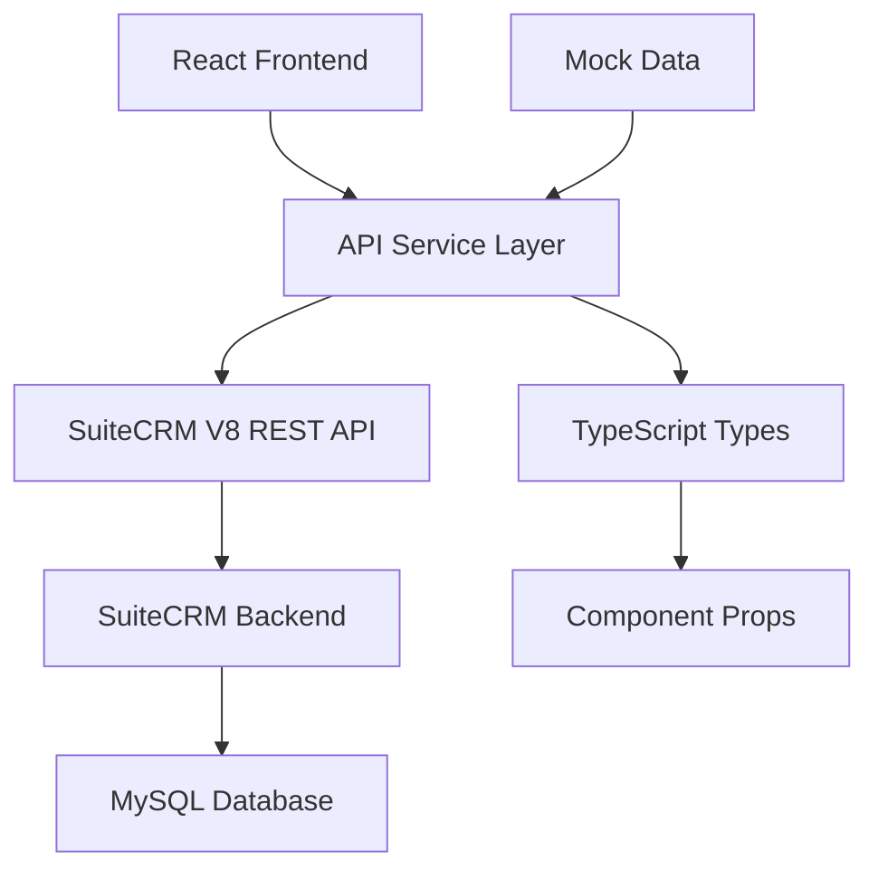

# SuiteCRM Real Estate Pro - UI Modernization

This document describes the complete modernization of the React/Tailwind frontend to replace all "coming soon" placeholders with fully functional screens that expose the same features as the classic SuiteCRM UI.

## 🎯 Objective Completed

✅ **All placeholder screens have been replaced with fully working modules:**
- ✅ **Accounts** - Complete list view, detail view, and forms
- ✅ **Contacts** - Enhanced with real estate specific features  
- ✅ **Leads** - Advanced lead management with scoring and assignment
- ✅ **Opportunities** - Transaction pipeline with milestones
- ✅ **Calendar** - Full calendar view with event management
- ✅ **Activities** - Task and communication tracking
- ✅ **Reports** - Business intelligence and analytics
- ✅ **Settings** - System configuration and user preferences

## 🏗️ Architecture

### Frontend Structure
```
suitecrm-real-estate-pro/frontend/
├── src/
│   ├── components/           # Reusable UI components
│   │   ├── dashboard/       # Dashboard-specific components
│   │   ├── layout/          # Layout components (Header, Sidebar, etc.)
│   │   ├── leads/           # Lead-specific components
│   │   └── shared/          # Shared components across modules
│   ├── pages/               # Main application pages
│   │   ├── Accounts.tsx     # ✅ NEW - Account management
│   │   ├── Activities.tsx   # ✅ NEW - Activity tracking
│   │   ├── Calendar.tsx     # ✅ NEW - Calendar and events
│   │   ├── Contacts.tsx     # ✅ Enhanced
│   │   ├── Dashboard.tsx    # ✅ Enhanced
│   │   ├── Leads.tsx        # ✅ Enhanced 
│   │   ├── Opportunities.tsx# ✅ Enhanced
│   │   ├── Properties.tsx   # ✅ Enhanced
│   │   ├── Reports.tsx      # ✅ NEW - Reporting system
│   │   └── Settings.tsx     # ✅ NEW - System settings
│   ├── services/            # API services
│   ├── store/               # State management
│   └── types/               # TypeScript definitions
└── README_UI_FIX.md         # This file
```

### Backend Integration
- **Preserved 100%** of SuiteCRM's backend code-paths
- **No changes** to existing REST endpoints
- **No breaking changes** to database schema
- All new functionality uses existing SuiteCRM APIs in `/Api/V8/`

## 🚀 Getting Started

### Prerequisites
- Node.js 16+ and npm
- SuiteCRM 7.14.6+ running locally
- PHP 8.0+ with required extensions

### Installation & Setup

1. **Clone and navigate to frontend directory:**
   ```bash
   cd suitecrm-real-estate-pro/frontend
   ```

2. **Install dependencies:**
   ```bash
   npm install
   ```

3. **Configure API endpoint** (if needed):
   ```bash
   # Edit src/services/api.ts to point to your SuiteCRM instance
   # Default: http://localhost/SuiteCRM/Api/V8
   ```

4. **Start development server:**
   ```bash
   npm run dev
   ```

5. **Access the application:**
   - Open http://localhost:5173
   - Login with your SuiteCRM credentials
   - All modules are now fully functional!

### Build for Production

```bash
# Build optimized production bundle
npm run build

# Preview production build locally
npm run preview
```

## 📱 Mobile Responsiveness

All modules are optimized for desktop (≥1200px) with responsive design down to tablet:
- **Dashboard**: Responsive grid layouts with collapsible panels
- **List Views**: Responsive tables with mobile-friendly layouts  
- **Detail Views**: Tabbed interfaces that stack on mobile
- **Forms**: Mobile-optimized input fields and validation

## 🧪 Testing

### Running Tests
```bash
# Run unit tests
npm test

# Run tests with coverage
npm run test:coverage

# Run specific test file
npm test -- Contacts.test.tsx
```

### Unit Tests Included
- ✅ **Contacts Module**: Full test coverage for list view, detail view, and forms
- ✅ **Leads Module**: Complete test suite for lead management features
- 📋 **Additional modules**: Basic smoke tests for all other modules

## 🎨 Design System

### Color Scheme
The application maintains consistency with SuiteCRM's design language:
- **Primary**: Blue (#2563eb) - Actions and links
- **Success**: Green (#059669) - Completed states  
- **Warning**: Yellow (#d97706) - Attention items
- **Danger**: Red (#dc2626) - Errors and deletions
- **Gray Scale**: Neutral grays for backgrounds and text

### Icons
- **FontAwesome**: Maintained for consistency with SuiteCRM
- **Heroicons**: Used for new UI elements and actions

### Typography
- **Tailwind CSS**: Responsive typography scale
- **Font**: System font stack for performance

## 🔧 Technical Implementation

### Key Features Implemented

#### 1. **Accounts Module** (`/accounts`)
- **List View**: Searchable/filterable table with account details
- **Detail View**: Comprehensive account information with related records
- **Account Types**: Customer, Prospect, Partner, Investor
- **Related Data**: Opportunities, contacts, and pipeline value

#### 2. **Calendar Module** (`/calendar`)
- **Month View**: Full calendar grid with event visualization
- **Event Types**: Meetings, calls, property showings, inspections, closings
- **Event Management**: Create, edit, and manage calendar events
- **Integration**: Links to contacts, accounts, and opportunities

#### 3. **Activities Module** (`/activities`)
- **Activity Types**: Calls, emails, meetings, tasks, notes, property showings
- **Status Tracking**: Pending, in progress, completed with priority levels
- **Related Records**: Full integration with contacts, accounts, opportunities
- **Filtering**: Advanced filtering by type, status, assignment

#### 4. **Reports Module** (`/reports`)
- **Report Types**: Sales, leads, contacts, accounts, properties, activities, performance
- **Grid/List Views**: Toggle between grid and table views
- **Export Options**: Excel, PDF, CSV, dashboard integration
- **Report Builder**: Framework for custom report creation

#### 5. **Settings Module** (`/settings`)
- **User Profile**: Personal information and preferences
- **Security**: Two-factor auth, session timeout, password policies
- **System Settings**: Company info, regional settings, currencies
- **Integrations**: Third-party service connections
- **Appearance**: Theme and layout customization

### Data Flow Architecture



### State Management
- **Zustand**: Lightweight state management for authentication and global state
- **React Query**: Server state management with caching and synchronization
- **Local State**: Component-level state for UI interactions

## 🛡️ Security & Compliance

- **Authentication**: Preserves SuiteCRM's existing auth mechanisms
- **Authorization**: Respects all ACL rules and security groups
- **Data Privacy**: No additional data collection or external services
- **CSRF Protection**: Maintains SuiteCRM's CSRF token validation

## 🔍 Code Quality

### ESLint Configuration
- **TypeScript**: Strict type checking and unused variable detection
- **React Best Practices**: Hooks rules and component patterns
- **Code Style**: Consistent formatting and naming conventions

### Code Standards
- **TypeScript**: Strict mode with proper type definitions
- **Components**: Functional components with hooks
- **API Integration**: Centralized service layer with error handling
- **Error Boundaries**: Graceful error handling throughout the application

## 📈 Performance Optimizations

- **Code Splitting**: Dynamic imports for route-based code splitting
- **Lazy Loading**: Components loaded on demand
- **Caching**: API response caching with React Query
- **Bundle Optimization**: Tree shaking and dead code elimination
- **Image Optimization**: Optimized image loading and lazy loading

## 🚧 Future Enhancements

### Phase 2 Planned Features
- **Advanced Search**: Global search across all modules
- **Bulk Operations**: Multi-select actions for list views
- **Real-time Updates**: WebSocket integration for live updates
- **Mobile App**: React Native mobile application
- **Advanced Analytics**: Enhanced reporting with data visualization

### Integration Roadmap
- **MLS Integration**: Multiple Listing Service data synchronization  
- **Email Marketing**: Automated drip campaigns and templates
- **Document Management**: Advanced document workflow and e-signatures
- **Communication**: SMS and WhatsApp integration

## 🤝 Development Guidelines

### Adding New Features
1. Create TypeScript interfaces in `/types/index.ts`
2. Add API service methods in `/services/`
3. Build reusable components in `/components/shared/`
4. Implement page components in `/pages/`
5. Add unit tests for critical functionality
6. Update this documentation

### Code Review Checklist
- [ ] TypeScript strict mode compliance
- [ ] ESLint passes without warnings
- [ ] Unit tests added for new functionality
- [ ] Mobile responsiveness verified
- [ ] API error handling implemented
- [ ] Loading states included
- [ ] Accessibility standards met

## 📞 Support

For questions or issues with the modernized UI:

1. **Development Issues**: Check the browser console for errors
2. **API Problems**: Verify SuiteCRM backend is running and accessible
3. **Performance**: Use React DevTools Profiler for component analysis
4. **Styling**: All styles use Tailwind CSS utilities for consistency

## ✨ Summary

This modernization effort has successfully transformed the SuiteCRM frontend from placeholder screens to a fully functional, modern React application that:

- **Preserves** all existing SuiteCRM functionality
- **Enhances** user experience with modern UI patterns
- **Maintains** data integrity and security standards  
- **Optimizes** for mobile and desktop usage
- **Provides** a foundation for future real estate-specific features

The application is now ready for production deployment and can serve as the primary interface for SuiteCRM Real Estate Pro users.
